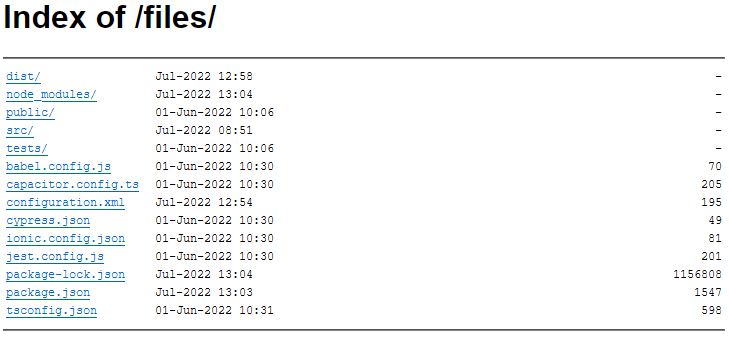

# express-autoindex

`express-autoindex` produce a directory listing like Nginx, Apache, etc...

It takes into consideration most of the mime-types correctly, and page generation is fully customizable.

The objectives are:
* Make a `HTML` page or `JSON` data easily usable, on the great majority of browsers
* Correctly take into consideration the majority of `MIME types`, and the generation of the most customizable pages possible
* Native support for `Typescript`, `EcmaScript` and `CommonJS`
* The least amount of dependency possible (currently only `one`)
* The `lightest` possible

<p align="center">
	
</p>

- [Install](#install)
- [API](#api)
	- [autoindex(path, options)](#autoindexpath-options)
	- [Options](#options)
- [Customization of the html page appearance](#customization-of-the-html-page-appearance)
	- [Variables](#variables)
	- [CSS](#css)
	- [HTML example](#html-example)
- [Customization of the JSON format](#customization-of-the-json-format)
	- [JSON example](#json-example)
- [Error handling](#error-handling)
	- [NodeJS error code list](#nodejs-error-code-list)
	- [Error code example](#error-code-example)
- [Minimalist example](#minimalist-example)
- [Production mode](#production-mode)
- [To do list](#to-do-list)
- [License](#license)
- [Dependencie](#dependencie)

## Install

```sh
# npm
npm install express-autoindex

# yarn
yarn add express-autoindex
```

## API

```ts
import autoindex from 'express-autoindex';

// Root of server, ./public dir
app.use(autoindex('public'))

// Specific path `/files`, ./public dir
app.use('/files', autoindex('public'));

// Set options
app.use('/files', autoindex('public', { dirAtTop: false, displaySize: false }));
```

### autoindex(path, options)

Returns middlware that serves an index of the directory in the given `path`.

The `path` is based of the `req.url` value, so a `req.url` of `'/some/dir`
with a `path` of `'public'` will look at `'public/some/dir'`.

### Options

`express-autoindex` accepts options:

* #### alwaysThrowError
  type: `boolean`

  Throw error for all HTTP error codes (**4xx** & **5xx**).

  By default, errors will be generated only on **5xx** types. If you wish to generate an error regardless of the HTTP error code, pass `true` to the option.

  **Default** to `false`

* #### cache
  type: `number | false`

  Caches for a defined time the generated pages. Very useful to save server resources.

  Pass `false` to disable the cache, or the number of milliseconds representing the cache expiration time.

  **Default** to `300000` = 5 mins

* #### customJsonFormat
	type: `object`
	```ts
	{
		isDir: string,
		name: string,
		path: string,
		time: string,
		size: string
	}
	```

  By default, the json generated for a file or folder follows a precise structure. It is possible to rename or remove the **key** of this object.

  **Default** to `undefined`

* #### customTemplate
	type: `string`
	
	Pass the relative path of your custom template file. For example, if the file is located in the same folder of your startup server file, simply write `my-file.html` or `./my-file.html`.

	**Default** to `undefined`

* #### dirAtTop
  type: `boolean`

  Display directories before files

  **Default** to `true`

* #### displayDate
  type: `boolean`

  Display the last modification date of the file or directory if available.

  **Default** to `true`

* #### displayDotfile
  type: `boolean`

  Display dotfiles (.env, .yarnrc, ...).

  **Default** to `false`

* #### displaySize
  type: `boolean`

  Display size of the file or directory if available.

  **Default** to `true`

* #### exclude
  type: `RegExp`

  Regular expression for files/dirs exclude, for example `/my-file.json|\*.cpp/`.

* #### json
  type: `boolean`

  Send data in json format instead of an html page. Might be useful if you want to use the data for another application.

  **Default** to `false`

* #### strict
  type: `boolean`

  Allow only `HEAD` and `GET` HTTP methods.
	
  **Default** to `true`

## Customization of the html page appearance

It is possible to customize the entire HTML page sent to the client. To do this, write an HTML page as usual. Then simply pass the path to your file with the `customTemplate` option.

### Variables

`express-autoindex` generates two variables:

1. **title** : the title of the generated page. Since this is an autoindex, the title represents the folder path
2. **content** : the contents of an html table representing the contents of the folder

To use variables in your template, simply call them between two curly brackets, like `{{title}}`.

### CSS

Elements inside a row of table all have their own *css* class linked to it, for easy access via a *css* selector. These classes are all placed on a <td>:

- **link** : url pointing to a file or folder
- **size** : folder or file size
- **time** : date of last folder or file modification

Don't forget that by default, every browser provides its own native *css*. If you want to standardize the look and feel, a little *css* will be necessary.

### HTML example

The html code below is the one generated by default. You can use it as inspiration to generate your own template.

```html
<!DOCTYPE html>
<html lang="en">
	<head>
		<meta charset="UTF-8" />
		<meta name="viewport" content="width=device-width, initial-scale=1.0" />
		<title>{{title}}</title>
	</head>
	<body>
		<h1>{{title}}</h1>
		<hr/>
		<table>{{content}}</table>
		<hr/>
	</body>
	<style type="text/css">
		html {
			font-family: Arial, Helvetica, sans-serif
		}
		table {
			font-family: 'Courier New', Courier, monospace;
			font-size: 12px;
			font-weight: 400;
			letter-spacing: normal;
			line-height: normal;
			font-style: normal;
		}
		tr td:first-child {
			min-width: 20%;
		}
		td a {
			margin-right: 1em;
		}
		td.size {
			text-align: end;
		}
	</style>
</html>
```

## Customization of the JSON format

It is possible to customize the entire JSON format of file or folder. To do this, pass an object containing the new key names to the `customJsonFormat` option.

By default, the object generated for an element is:
- *isDir* → (**boolean**) is a folder
- *name* → (**string**) the name
- *path* → (**string**) the path (url)
- *time* → (**string**) the UTC date of the last modification
- *size* → (**number**) file size, `null` on a folder

The option object works according to three simple rules:
1. To change the name of the key, simply write an entry with the key you wish to change and the value representing its new name.
2. If a key is missing, it will not be added.
3. Any key that does not exist by default will not be added.


### JSON example

Here are a few examples to help you understand how it works:

<table>
<tr>
	<td>Options</td>
	<td>Generated JSON</td>
</tr>
<tr>
<td>

```json
{
	"isDir": "isADirectory",
	"name": "nameOfElement",
	"path": "url",
	"time": "date",
	"size": "weight"
}
```
</td>
<td>

```json
{
	"isADirectory": false,
	"nameOfElement": "history.md",
	"url": "/public/random_dir/history.md",
	"date": "07-Jul-2022 08:19",
	"weight": 348
}
```
</td>
</tr>
<tr>
<td>

```json
{
	"name": "nameOfElement",
	"path": "path"
}
```
</td>
<td>

```json
{
	"nameOfElement": "history.md",
	"path": "/public/random_dir/history.md"
}
```
</td>
</tr>
<tr>
<td>

```json
{
	"name": "name",
	"nonexistentKey": "defaultValue"
}
```
</td>
<td>

```json
{
	"name": "history.md"
}
```
</td>
</tr>
</table>

## Error handling

`express-autoindex` will do its best to handle Node.js errors correctly by converting them into a valid HTTP error. The default error type is **500**.

In no case `express-autoindex` handles custom error pages. The only thing done is to modify the statusCode of the `res` object and generate an error if necessary.

### NodeJS error code list

Below is a list of currently supported errors.

This is how to read the list: *The Node error code* → (**the related HTTP code**) "The error message".

- *EBADF* → (**500**) fd is not a valid open file descriptor
- *EFAULT* → (**500**) Bad address
- *EINVAL* → (**500**) Invalid flag specified in flag
- *ELOOP* → (**500**) Too many symbolic links encountered while traversing the path
- *ENOMEM* → (**500**) Out of memory
- *EOVERFLOW* → (**500**)	pathname or fd refers to a file whose size, inode number,
	</br>
	or number of blocks cannot be represented in, respectively, the types off_t, ino_t, or blkcnt_t.
	</br>
	This error can occur when, for example, an application compiled on a 32-bit platform
	</br>
	without -D_FILE_OFFSET_BITS=64 calls stat() on a file whose size exceeds (1<<31)-1 bytes
- *EACCES* → (**500**) Permission denied
- *EADDRINUSE* → (**500**) Address already in use
- *ECONNREFUSED* → (**500**) Connection refused
- *ECONNRESET* → (**500**) Connection reset by peer
- *EEXIST* → (**500**) File exists
- *EISDIR* → (**500**) Is a directory
- *EMFILE* → (**500**) Too many open files in system
- *ENAMETOOLONG* → (**414**) URI Too Long
- *ENOENT* → (**404**) No such file or directory
- *ENOTDIR* → (**404**) Not a directory
- *ENOTEMPTY* → (**500**) Directory not empty
- *ENOTFOUND* → (**500**) DNS lookup failed
- *EPERM* → (**403**) Operation not permitted
- *EPIPE* → (**500**) Broken pipe
- *ETIMEDOUT* → (**408**) Request Timeout

### Error code example

To handle these errors, all you need to do after calling this middleware is to use a code of this type:

```ts
import { STATUS_CODES } from 'http';
[...]
app.use((_req, res) => {
	// 4xx errors
	res.send(`<h1>${res.statusCode} ${STATUS_CODES[res.statusCode]}</h1>`);
});

app.use((err, _req, res, next) => {
	// 5xx errors
	res.send(`<h1>${res.statusCode} ${STATUS_CODES[res.statusCode]}</h1>`);
	if (err)
		console.error(err);
	next();
});
[...]
```

## Minimalist example

```ts
import express from 'express';
import autoindex from 'express-autoindex';
import type { Application, NextFunction, Request, Response } from 'express';

const app: Application = express();
const PORT = process.env.PORT || 3000;

app.disable('x-powered-by');

app.use(express.urlencoded({ extended: true }));
app.use(express.json());
app.use('/public', autoindex('public'));

app.listen(PORT, (): void => console.log(`server is running at ${PORT}`));
```

## Production mode

When the variable `process.env.NODE_ENV` is set to **production**, error messages are much less detailed for security reasons.

## To do list

1. Formatting of file modification dates
2. Open the middleware for use outside express.js

## License

[MIT](LICENSE)

## Dependencie

[mime](https://www.npmjs.com/package/mime)
